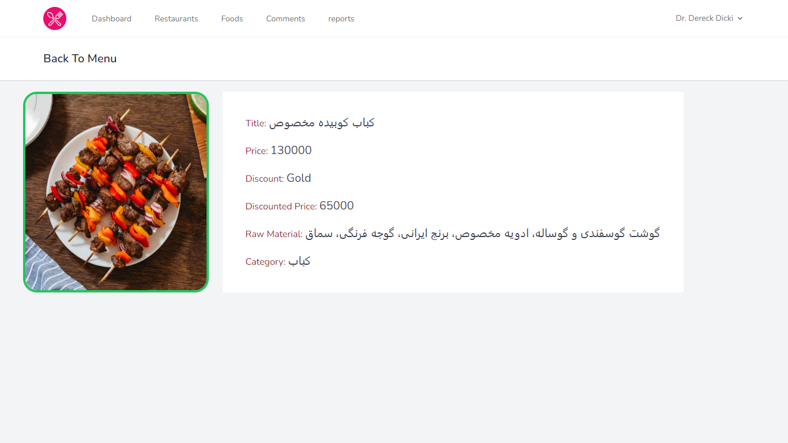
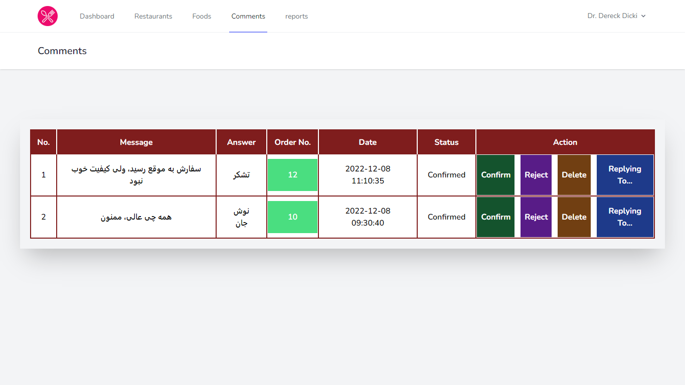
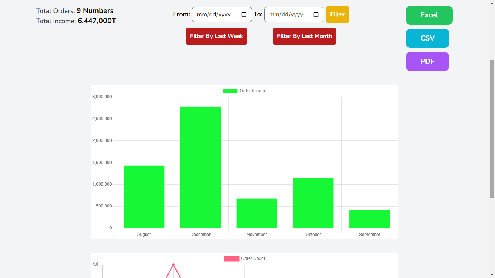
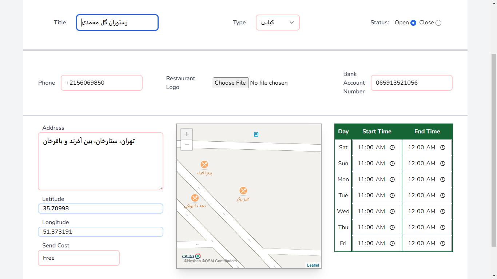
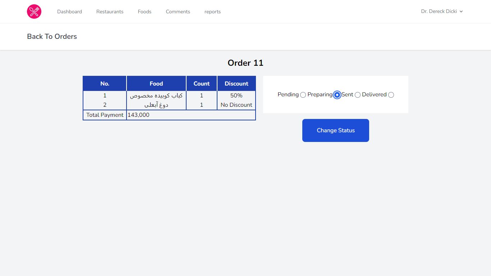

## Features

- Authentication system by laravel [breeze](https://laravel.com/docs/9.x/starter-kits#laravel-breeze).
- Make separate panel for the admin and seller.
- Authorizing
    - Use guard to authorizing the seller and admin.
    - Use laravel sanctum to authorizing user as a customer.
- Send email to the customer at any stage of the order status with job and [queue](https://laravel.com/docs/9.x/queues).

## Seller's Panel:

- Profile
    - First, seller should be filled restaurant profile
    - even he/she can use other features in seller's panel.
    - later the seller can [edit](#editing-restaurant-info) restaurant info.
- [Orders](#order-details)
    - Recieve active orders in the dashboard and access their details.
    - After the order is received by the customer, it will be transferred to the orders archive tab.
- [Foods](#foods)
    - Add foods to restaurant menu and CRUD on the food.
- [Comments](#comments)
    - see all comments related to orders,
    - confirm them to show the other customers,
    - make delete request and send to the admin for deleting specific comment.
    - Reply to comment message by the seller.
- [Reports](#reporsts)
    - Ability to report income and number of orders  
    - filter them between two dates, last week or last month. 
    - export the report to [excel](https://packagist.org/packages/maatwebsite/excel).  

## Admin's Panel:

- Making Categories for restaurants and foods.
- Adding banner to display in customer side.
- Adding discounts to use the seller in her/his foods.
- Delete comments requested by the seller.

---

## Steps:

- Receive project

<pre><code>git clone https://github.com/omid-d94/snappfood.git </code></pre>

- Change directory to project directory

<pre><code>cd snappfood</code></pre>

- completing variables in <b>.env</b> file

<pre><code>cp .env.example .env</code></pre>

- Installing dependencies that used in project.

<pre><code>composer install --ignore-platform-reqs </code></pre>

- Updating packages if you want!

<pre><code>composer update --ignore-platform-reqs </code></pre>

- Installing packages like tailwindcss that used in project

<pre><code>npm install & npm run build</code></pre>

- For encrypting cookies

<pre><code>php artisan key:generate</code></pre>

- After creating the new database and set config for it, now you can migrate tables into database with fake data by
  seeders.

<pre><code>php artisan migrate --seed</code></pre>

- credentials for admin
    - 
email: <pre><code>admin@admin.com</code></pre>

    - 
password: <pre><code>password</code></pre>

---

## Screenshots

- ### Foods:

- ### comments:

- ### reports:

- ### editing restaurant info:

- ### order details

